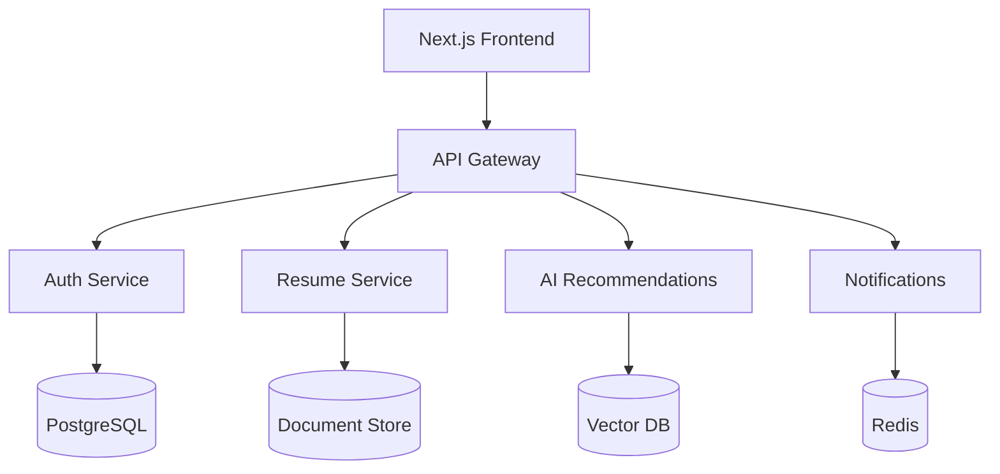

# RoleWithAI System Architecture

## System Overview

RoleWithAI is a modern, scalable career development platform built with Next.js, React, and a microservices architecture. The system is designed to provide personalized career guidance, skill tracking, and interactive learning experiences.

## Component Architecture



## Core Services

### 1. Frontend (Next.js + React)
- **Pages**: Dashboard, Skills, Roadmap, Mentor, Community
- **Components**: Reusable UI primitives with shadcn/ui
- **State Management**: React Query + Zustand
- **Styling**: Tailwind CSS + CSS Modules

### 2. Backend Services

#### Authentication Service
- NextAuth.js + Prisma
- JWT-based authentication
- Role-based access control
- OAuth providers (Google, GitHub)

#### Resume Analysis Service
- Node.js/Express
- spaCy for NLP
- PDF parsing with pdf.js
- Skill extraction and matching

#### AI Recommendations Service
- Python/Flask
- GPT-4 integration
- Vector embeddings for similarity search
- Caching layer with Redis

#### Real-time Notifications
- WebSocket server
- Firebase Realtime Database
- Push notifications

## API Contracts

### REST Endpoints

```typescript
// Dashboard KPIs
GET /api/dashboard/kpis
Response: {
  weeklyXp: number;
  skillsProgress: SkillProgress[];
  streak: number;
  recentActivity: Activity[];
}

// Resume Upload & Analysis
POST /api/resume/upload
Request: FormData (file)
Response: {
  skills: string[];
  experience: Experience[];
  recommendations: string[];
}

// Skill Recommendations
GET /api/skills/recommendations
Response: {
  recommendedSkills: Skill[];
  learningPaths: Path[];
  resources: Resource[];
}

// Mock Interview
POST /api/interview/mock
Request: {
  role: string;
  level: string;
  audio?: Blob;
}
Response: {
  feedback: string;
  score: number;
  improvements: string[];
}
```

## Data Models

### User Profile
```typescript
interface User {
  id: string;
  email: string;
  name: string;
  role: string;
  level: string;
  skills: Skill[];
  xp: number;
  achievements: Achievement[];
}
```

### Skill
```typescript
interface Skill {
  id: string;
  name: string;
  category: string;
  level: number;
  xp: number;
  resources: Resource[];
}
```

## Infrastructure

### Development
- Docker Compose for local development
- Hot reloading with Next.js
- TypeScript strict mode
- ESLint + Prettier

### Production
- Vercel for frontend deployment
- AWS ECS for microservices
- AWS RDS for PostgreSQL
- Redis for caching
- CloudFront CDN

### Monitoring
- Prometheus metrics
- Grafana dashboards
- Error tracking with Sentry
- Performance monitoring with New Relic

## Security

- Rate limiting on AI endpoints
- JWT token validation
- CORS configuration
- Input sanitization
- XSS protection
- CSRF tokens

## Performance

- Edge caching with Vercel
- Image optimization
- Code splitting
- Lazy loading
- Service worker for offline support

## CI/CD Pipeline

1. **Build**
   - TypeScript compilation
   - ESLint checks
   - Unit tests
   - Build Docker images

2. **Test**
   - Integration tests
   - E2E tests with Cypress
   - Performance benchmarks
   - Security scans

3. **Deploy**
   - Staging deployment
   - Smoke tests
   - Production deployment
   - Post-deployment verification

## Scalability Considerations

- Horizontal scaling of microservices
- Database sharding strategy
- Caching layers
- CDN integration
- Load balancing
- Auto-scaling groups 