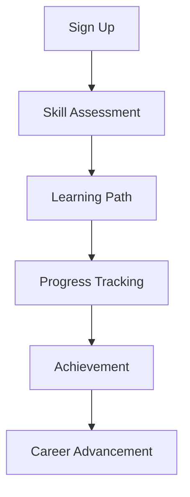

# Product Management

## Product Vision

RoleWithAI is an AI-powered career development platform that helps professionals navigate their career journey through personalized guidance, skill tracking, and interactive learning experiences.

## Target Audience

### Primary Users
- Early to mid-career professionals
- Career changers
- Tech industry professionals
- Learning enthusiasts

### User Personas

1. **Alex - Career Changer**
   - Background: Marketing professional
   - Goal: Transition to AI/ML
   - Pain Points: Unclear path, skill gaps
   - Needs: Structured learning, mentorship

2. **Sarah - Tech Professional**
   - Background: Software Engineer
   - Goal: Career advancement
   - Pain Points: Skill validation, networking
   - Needs: Skill assessment, industry insights

3. **Michael - Learning Enthusiast**
   - Background: Data Analyst
   - Goal: Continuous learning
   - Pain Points: Time management, focus
   - Needs: Personalized learning, progress tracking

## Product Strategy

### 1. Core Value Proposition
- AI-powered career guidance
- Personalized learning paths
- Skill development tracking
- Human-AI hybrid mentorship

### 2. Competitive Advantage
- Advanced AI personalization
- Gamified learning experience
- Comprehensive skill tracking
- Integrated mentorship platform

### 3. Market Positioning
- Premium career development platform
- Focus on tech industry
- Emphasis on practical skills
- Community-driven learning

## Feature Roadmap

### Q1 2024
- [x] Core platform launch
- [x] Basic AI mentor
- [x] Skill tracking
- [x] Learning paths

### Q2 2024
- [ ] Advanced AI mentor
- [ ] Human mentor matching
- [ ] Career roadmap visualization
- [ ] Community features

### Q3 2024
- [ ] AI-powered resume builder
- [ ] Interview preparation
- [ ] Skill certification
- [ ] Job matching

### Q4 2024
- [ ] Enterprise features
- [ ] Advanced analytics
- [ ] Mobile app
- [ ] API access

## Feature Specifications

### 1. AI Mentor

#### Core Features
- Natural language chat interface
- Career advice generation
- Learning path recommendations
- Progress tracking

#### Technical Requirements
- GPT-4 integration
- Real-time response
- Context awareness
- Conversation history

#### Success Metrics
- User engagement
- Advice quality
- User satisfaction
- Learning outcomes

### 2. Skill Tracking

#### Core Features
- Skill assessment
- Progress visualization
- Learning recommendations
- Achievement system

#### Technical Requirements
- Skill database
- Progress tracking
- Recommendation engine
- Gamification system

#### Success Metrics
- Skill improvement
- User engagement
- Completion rates
- User satisfaction

### 3. Learning Paths

#### Core Features
- Personalized curriculum
- Progress tracking
- Resource recommendations
- Milestone system

#### Technical Requirements
- Curriculum engine
- Progress tracking
- Resource management
- Assessment system

#### Success Metrics
- Completion rates
- Learning outcomes
- User satisfaction
- Time to completion

## User Experience

### 1. User Journey

### 2. Key Interactions

1. **Onboarding**
   - Skill assessment
   - Goal setting
   - Learning path selection

2. **Daily Engagement**
   - Progress tracking
   - Learning activities
   - Mentor interactions

3. **Achievement**
   - Skill milestones
   - Learning completion
   - Career advancement

## Metrics & Analytics

### 1. User Metrics
- Daily Active Users (DAU)
- Monthly Active Users (MAU)
- User retention
- Engagement time

### 2. Learning Metrics
- Course completion
- Skill improvement
- Learning time
- Assessment scores

### 3. Business Metrics
- Revenue
- Customer acquisition
- Churn rate
- Lifetime value

## Marketing Strategy

### 1. Target Channels
- Tech communities
- Professional networks
- Learning platforms
- Industry events

### 2. Content Strategy
- Career guides
- Success stories
- Industry insights
- Learning resources

### 3. Growth Tactics
- Referral program
- Community building
- Content marketing
- Partnership programs

## Pricing Strategy

### 1. Free Tier
- Basic AI mentor
- Limited skill tracking
- Community access
- Basic learning paths

### 2. Pro Tier
- Advanced AI mentor
- Full skill tracking
- Human mentor access
- Premium learning paths

### 3. Enterprise Tier
- Custom solutions
- Team features
- Advanced analytics
- API access

## Success Criteria

### 1. User Success
- Skill improvement
- Career advancement
- Learning completion
- User satisfaction

### 2. Business Success
- Revenue growth
- User acquisition
- Retention rates
- Market share

### 3. Platform Success
- System performance
- Feature adoption
- User engagement
- Platform stability

## Risk Management

### 1. Technical Risks
- AI model accuracy
- System scalability
- Data security
- Performance issues

### 2. Business Risks
- Market competition
- User adoption
- Revenue generation
- Resource allocation

### 3. Mitigation Strategies
- Regular testing
- User feedback
- Market research
- Resource planning

## Stakeholder Management

### 1. Internal Stakeholders
- Development team
- Product team
- Marketing team
- Support team

### 2. External Stakeholders
- Users
- Partners
- Investors
- Industry experts

### 3. Communication Plan
- Regular updates
- Feedback channels
- Progress reports
- Stakeholder meetings

## Future Vision

### 1. Short-term Goals
- Platform stability
- User growth
- Feature completion
- Market penetration

### 2. Long-term Goals
- Market leadership
- Global expansion
- Advanced AI capabilities
- Industry standards

### 3. Innovation Areas
- AI technology
- Learning methods
- User experience
- Platform capabilities 